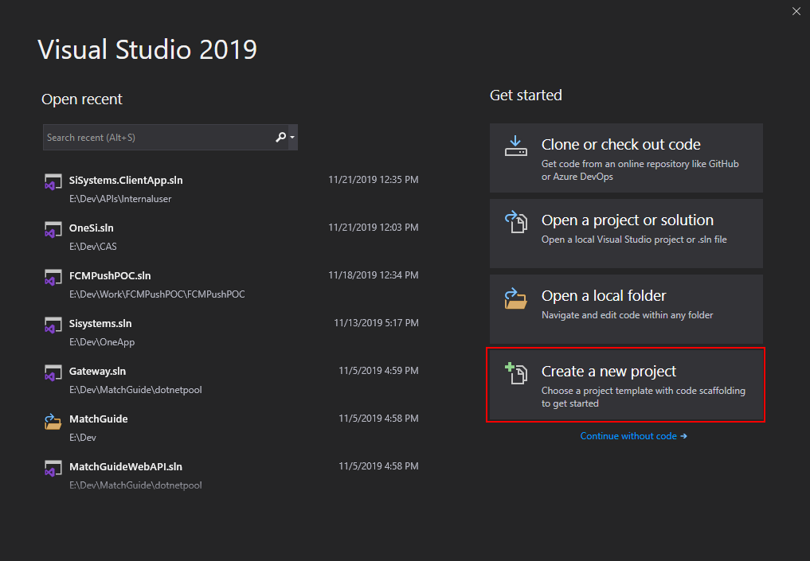
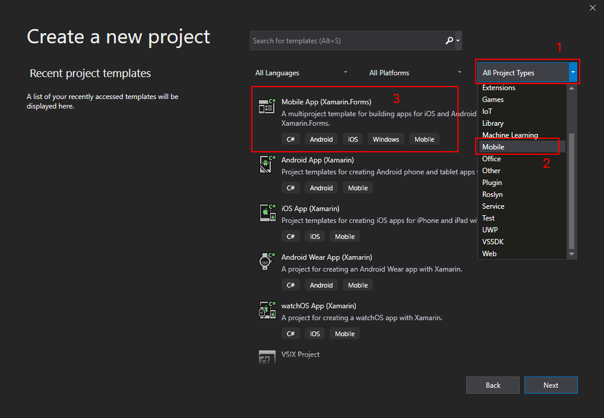
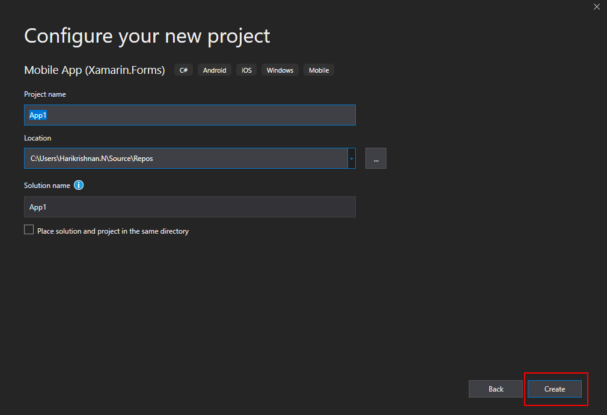
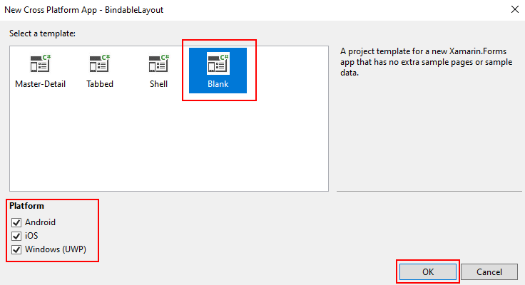
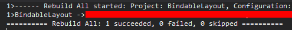
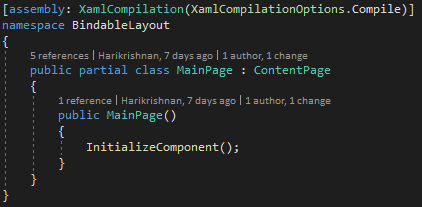
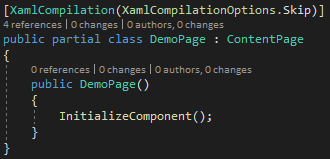
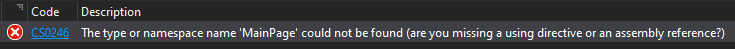
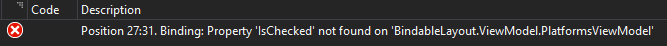
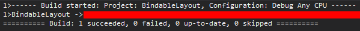

XamarinForms-Compiled Bindings
===============================

In this article, you will learn what Compiled Bindings in Xamarin is all about and how to use it to improve performance and avoid spelling errors.

Xamarin.Forms is an open-source UI framework that runs on multiple platforms with a single shared codebase. It allows developers to create user interfaces in XAML with code-behind in C#. These interfaces are rendered as performant native controls on each platform.

# Compiled Bindings
If you are a Xamarin or .Net developer you would probably know what is [DataBinding](https://docs.microsoft.com/en-us/xamarin/xamarin-forms/xaml/xaml-basics/data-binding-basics). It is a concept where you can dynamically load in all the pages information at runtime when the user is navigating to a page. However, when you have pages that are really complicated that have a lot of DataBinding, then it can take a lot of time for Xamarin to look at every single element of the XAML.

Moreover, as a developer if you have misspelled something you probably won't know the error until you navigate to that page and see how the UI renders. Only at the runtime when the UI loads we would realize that this is not what we expect it to be. So we use the compiled bindings to solve these problems.

**In simple words, Compiled Bindings just tells your app to compile the XAML stuff before you run the app.**

The advantage of the Compiled Bindings are: 
* More performance
* Catches spelling errors and other issues with data binding at compile-time and build time itself

 ### Prerequisites
* Visual Studio 2017 or later (Windows or Mac)

Let's take the XAML code from my article BindableLayout as an example for understanding what is Compiled Bindings in Xamarin.Forms.

## Setting up a Xamarin.Forms Project
Let’s start by creating a new Xamarin.Forms project by following the below steps.
 
Visual Studio 2019 has more options in the launch view. 
* Clone or check out the code from any repository 
* Open a project or solution
* Open a local folder from your computer 
* Create a new project. 
 
Choose "Create a new project".
<p align="center">
  
</p>

Now, filter by Project Type as Mobile and choose the Mobile App (Xamarin.Forms).
<p align="center">
  
</p>

Enter the project name of your wish. Usually, the project and solution name are the same for an app. Choose your preferred location for the project and click "Create".
<p align="center">
  
</p>

Select the Blank App and target platforms - Android, iOS and Windows (UWP).
<p align="center">
  
</p>

Wait for the solution to load. Expand the solution using the Solution Explorer. By default, you can see 4 projects (.NET Standard, Android, iOS and UWP). 
 
Expand the .NET Standard project and select the XAML page and double-click to open the MainPage.xaml page. You now have a basic Xamarin.Forms app. Press F5 or click the run button to try it out.

## Setting up the model and view model

For that first lets us create the model and view model classes required for binding to the view.
 
Create a new class called PlatformInfo.cs and declare the below properties.
```c#
public class PlatformInfo
{
    public bool IsChecked { get; set; }
	public string PlatformName { get; set; }
}
```
Create a new class called ViewModel.cs and write the below code. 
```c#
public class ViewModel
{
    public ViewModel()
    {
        this.GetContactsList();
    }

    public List<PlatformInfo> PlatformsList { get; set; }

    private void GetContactsList()
    {
        if (this.PlatformsList == null)
            this.PlatformsList = new List<PlatformInfo>();

        this.PlatformsList.Add(new PlatformInfo() { IsChecked = true, PlatformName = "Android" });
        this.PlatformsList.Add(new PlatformInfo() { IsChecked = true, PlatformName = "iOS" });
        this.PlatformsList.Add(new PlatformInfo() { IsChecked = false, PlatformName = "UWP" });
    }
} 
```

## Setting up the User Interface
Go to MainPage.xaml and write the following code

```xaml
<?xml version="1.0" encoding="utf-8" ?>
<ContentPage xmlns="http://xamarin.com/schemas/2014/forms"
             xmlns:x="http://schemas.microsoft.com/winfx/2009/xaml"
             xmlns:d="http://xamarin.com/schemas/2014/forms/design"
             xmlns:mc="http://schemas.openxmlformats.org/markup-compatibility/2006"
             xmlns:viewModel="clr-namespace:BindableLayout.ViewModel"
             mc:Ignorable="d"
             x:Class="BindableLayout.MainPage">
    <ContentPage.BindingContext>
        <viewModel:PlatformsViewModel />
    </ContentPage.BindingContext>
    <StackLayout x:Name="contactList" BindableLayout.ItemsSource="{Binding PlatformsList}">
        <BindableLayout.ItemTemplate>
            <DataTemplate>
                <StackLayout Orientation="Horizontal">
                    <CheckBox IsChecked="{Binding IsChecked}" VerticalOptions="Center" />
                    <Label TextColor="Black" Margin="10,0" Text="{Binding PlatformName}" VerticalOptions="Center" />
                </StackLayout>
            </DataTemplate>
        </BindableLayout.ItemTemplate>
    </StackLayout>
</ContentPage>
```

Now, you could see that I have misspelled the property name bound to the ItemsSource property. Let's try to build this project. You could see that the project is still build perfectly.
<p align="center">
  
</p>

So now, let's turn on the compiled bindings to get this caught in the build time itself. The first thing to do is to our app to compile the XAML for the entire assembly. Type below code in the MainPage.xaml.cs as shown in the below image. 

```xaml
[assembly:XamlCompilation(XamlCompilationOptions.Compile)]
```
<p align="center">
  
</p>

 You can even skip this setting to be applied for a page(s) as shown below.

<p align="center">
  
</p>

Now let's just go to the XAML page and tell it what to just check against. The data for the XAML comes from PlatformsViewModel which is separated from the XAML front end. So we need to tell the XAML file where to find the PlatformsViewModel and that PlatformsViewModel is what it should be checking XAML data types against. We have already declared the namespace where we have the PlatformsViewModel. All we need to do is mention the data type for the content page to be of type ViewModel (2nd line in the below code snippet).

```xaml
xmlns:viewModel="clr-namespace:BindableLayout.ViewModel"  
x:DataType="viewModel:PlatformsViewModel"  
```

Let's try to build the project again.  
 
That's great..! Now, you could see a build error caught in the build time itself. 

<p align="center">
  
</p>

Now, let's correct the property name bound to the ItemsSource of the BindableLayout from PlatformList to PlatformsList as declared in the PlatformsViewModel. Let's try to build the project again. You could still see that we are getting a build error.  

<p align="center">
  
</p>

The reason for this build error is we are missing an important thing here. The DataTemplate which is in the bindable layout tells the bindable layout how to display each individual item in it. Also, we could see that it has different items that are not of type PlatformsViewModel but of type PlatformInfo. So we have to do the same thing similar to the XAML file on the data template to tell them what its data type is. Insert the below codes in your XAML. 

```xml
xmlns:models="clr-namespace:BindableLayout.Model"  
```

```xml
<DataTemplate x:DataType="models:PlatformInfo">  
    ...  
</DataTemplate>
```

Below is how the final XAML code looks like. 

```xml
<?xml version="1.0" encoding="utf-8" ?>  
<ContentPage xmlns="http://xamarin.com/schemas/2014/forms"  
             xmlns:x="http://schemas.microsoft.com/winfx/2009/xaml"  
             xmlns:d="http://xamarin.com/schemas/2014/forms/design"  
             xmlns:mc="http://schemas.openxmlformats.org/markup-compatibility/2006"  
             xmlns:viewModel="clr-namespace:BindableLayout.ViewModel"  
             x:DataType="viewModel:PlatformsViewModel"  
             xmlns:models="clr-namespace:BindableLayout.Model"  
             mc:Ignorable="d"  
             x:Class="BindableLayout.MainPage">  
    <ContentPage.BindingContext>  
        <viewModel:PlatformsViewModel />  
    </ContentPage.BindingContext>  
    <StackLayout x:Name="contactList" BindableLayout.ItemsSource="{Binding PlatformsList}">  
        <BindableLayout.ItemTemplate>  
            <DataTemplate x:DataType="models:PlatformInfo">  
                <StackLayout Orientation="Horizontal">  
                    <CheckBox IsChecked="{Binding IsChecked}" VerticalOptions="Center" />  
                    <Label TextColor="Black" Margin="10,0" Text="{Binding PlatformName}" VerticalOptions="Center" />  
                </StackLayout>  
            </DataTemplate>  
        </BindableLayout.ItemTemplate>  
    </StackLayout>  
</ContentPage>
```

Now let's just rebuild the app again. You could see that the build is succeeded now. 

<p align="center">
  
</p>
 
I hope now you have understood what is Bindable Layout and how to use it in Xamarin.Forms.
 
Thanks for reading. Please share your comments and feedback. Happy Coding…!


Author
======
Harikrishnan